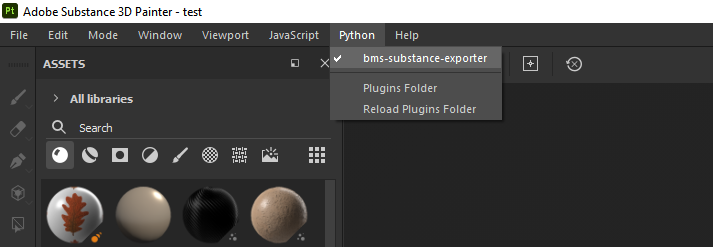
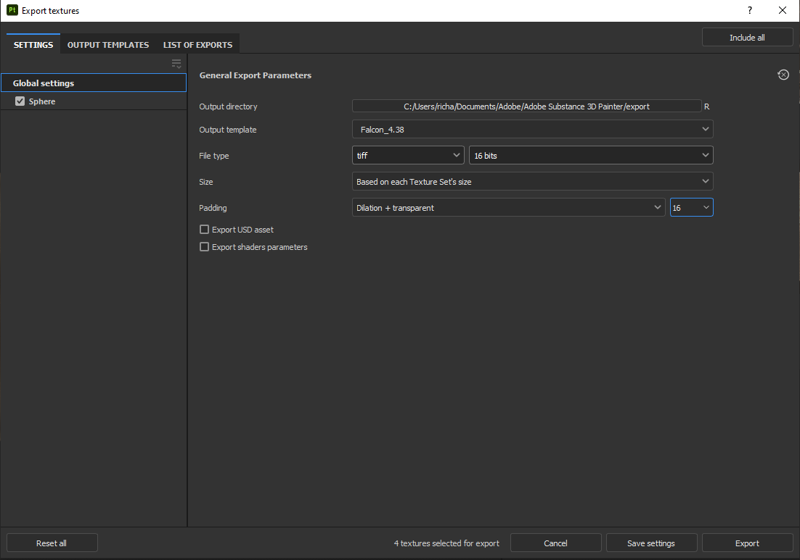

# bms-substance-exporter

### Plugin for one-click texture exports of Adobe Substance 3D Painter

## Installation
* Locate your Adobe Substance Painter user directory. This is usally located in your `Documents\Adobe\Adobe Substance 3D Painter` folder. 
* Copy the `bms-substance-exporter.py` script to the `python\plugins` subfolder.
* Get the newest release of `texconv.exe` and store it in the same directory as the `bms-substance-exporter.py` script. You can find their repo [here.](https://github.com/microsoft/DirectXTex/releases)
* Copy the export preset `Falcon_4.38.spexp` to the `assets\export-presets` subfolder.
* Start Adobe Substance Painter. If Substance Painter is already running, select *Reload plugins folder* from the *Python* dropdown menu.
* Enable the plugin in the *Python* dropdown menu.

## Usage
When the plugin is enabled, it is invoked automatically after every texture export from Substance Painter. It will check the exported files for the following suffixes:
* _Albedo
* _ARMW
* _Emission
* _Normal

To make sure your files are exported correctly, make sure you have the ``Falcon_4.38.spexp`` preset selected in the Export Dialog. You can use any resolution or file-format, however uncompressed formats with sufficient bit-depth (e.g. 16-bit TIFF) will give the best results. The plugin will not resize the textures on export.
The converted DDS files will be placed in the same directory as the exported textures. Any existing DDS files with the same name will be overwritten.

To disable the plugin, simply disable it from the *Python* dropdown menu.

## Credits
Arty for creating the export preset.
